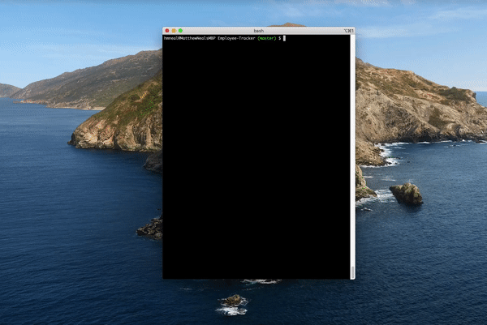

# Employee Manager  
  
 ## Table of Contents:  
[1. Description](#Description)  
[2. Installation](#Installation)  
[3. App Usage](#App-Usage)  
[4. License Details](#License-Details)  
[5. List of Contributors](#List-of-Contributors)  
[6. Tests](#Tests)  
[7. Questions](#Questions)  
## Description:
Developers are often tasked with creating interfaces that make it easy for non-developers to view and interact with information stored in databases. Often these interfaces are known as Content Management Systems. This application was created with node, inquirer, and MySQL.
## Installation:
Clone this app from https://github.com/Matthew-Neal/Employee-Tracker.git Once downloaded open the root folder in terminal/bash and run "npm i mysql inquirer" 
## App Usage:
Once installedd open terminal/bash to the root folder athen run "npm start.js" Follow the prompts.
## License Details:  
 Open source licenses grant permission for anybody to use, modify, and share licensed software for any purpose, subject to conditions preserving the provenance and openness of the software. The following licenses are sorted by the number of conditions, from most (GNU AGPLv3) to none (Unlicense). Notice that the popular licenses featured on the home page (GNU GPLv3 and MIT) fall within this spectrum.   
## List of Contributors:
none
## Tests:
Functionallity test
## Questions:
 Here is a link to my github:  
https://github.com/Matthew-Neal  
 Email me at:  
impulseimg@gmail.com  
for additional questions

